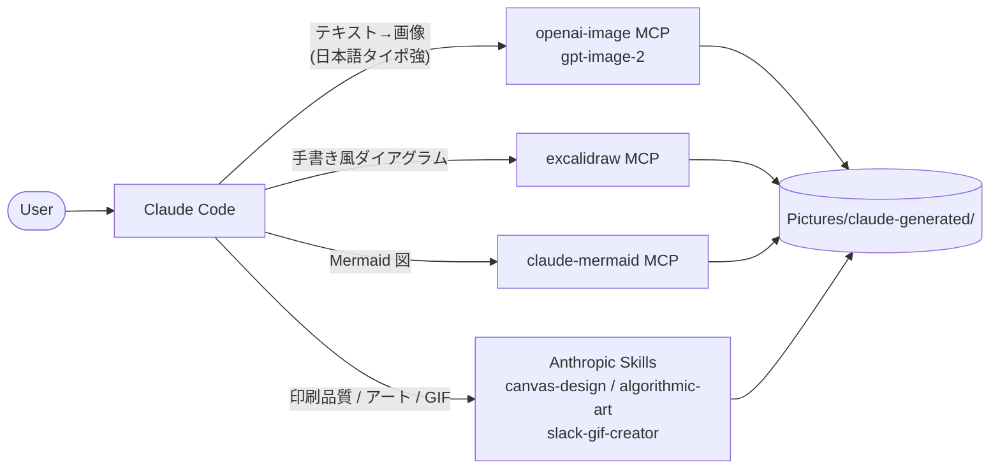

<p align="center">
  
</p>

# claude-image-tools

[](LICENSE)
[](#quick-start-windows)
[](https://claude.com/claude-code)

[English](README.md) · **日本語**

> **Claude Code での画像生成を一箇所に — お願いするだけ。**
> Claude Code から呼べる画像生成ツール（MCP / Skill）を **Windows で一気に揃える** ための運用ハブ。OG バナー・ダイアグラム・ポスター・GIF を「Claude にお願いするだけ」で出せる状態に整える。

## 30 秒で何が手に入るか

Claude Code に頼める内容と、裏で動くツール:

| 言ったこと | 動くツール | 出てくるもの |
|---|---|---|
| 「OG バナー作って、中央に "Caveat" の日本語タイトル」 | `openai-image` (gpt-image-2) | 1024×1024 〜 1536×1024 PNG（日本語の文字描画が崩れない） |
| 「3 ノードのアーキ図、手書き風で」 | `excalidraw` MCP | 編集可能な excalidraw シーン + PNG export |
| 「フローチャート: A → B → C」 | `claude-mermaid` MCP | Mermaid 図のライブプレビュー + PNG/SVG |
| 「Caveat 用ポスター、レイアウト凝って」 | Anthropic Skill `canvas-design` | 印刷品質 PNG/PDF |
| 「Slack 用に 3 秒の祝いアニメ GIF」 | Anthropic Skill `slack-gif-creator` | 100KB 以下の最適化済み GIF |
| 「コード生成アート、p5.js で」 | Anthropic Skill `algorithmic-art` | パラメタ可変のジェネレ作品 |

## 構成



## 似た選択肢との違い

| アプローチ | 良い点 | このリポジトリの違い |
|---|---|---|
| 単独 MCP（`openai-image` だけ等）を入れる | シンプル | 用途別に最適なツールを揃え、**Claude が場面ごとに選べる** |
| ChatGPT / Midjourney の Web UI | 即使える | エディタを離れずに **生成 → 配置 → コミット** が一本で繋がる |
| `gpt-image` を直接 API で叩く | 自由 | 構成図 / 手書き風 / GIF / 印刷レイアウト等、**画像種別ごとに別ツール** を呼び分けてくれる |

## Quick start (Windows)

> **前提**: Claude Code、Node.js、Python (uv)、`OPENAI_API_KEY` を Windows ユーザー環境変数に登録済み。

```powershell
# 1. openai-image MCP (gpt-image-2)
uv tool install openai-gen-image-mcp
claude mcp add --scope user openai-image `
  -e OPENAI_API_KEY=$env:OPENAI_API_KEY `
  -- C:/Users/<your-username>/.local/bin/openai-gen-image-mcp.exe

# 2. claude-mermaid (Mermaid 図)
npm install -g claude-mermaid
claude mcp add --scope user mermaid -- claude-mermaid

# 3. excalidraw MCP (手書き風ダイアグラム)
git clone https://github.com/yctimlin/mcp_excalidraw
cd mcp_excalidraw
npm install; npm run build
claude mcp add --scope user excalidraw -- node "$PWD/dist/index.js"
# 利用時は別プロセスで起動: npm run canvas (port 3000)

# 4. Anthropic Skills 一括導入
claude plugin install example-skills@anthropic-agent-skills
```

> `<your-username>` は自分の Windows アカウント名（`%USERNAME%` の値）に置き換える。

接続確認:

```bash
claude mcp list
# excalidraw / openai-image / mermaid が ✓ Connected で並べば成功
```

## 動作確認プロンプト

新しい Claude Code セッションで投げる。`<your-username>` は自分の Windows
アカウント名に置き換えるか、`output_path` を書き込み可能な任意のフォルダ
（例: `~/Pictures/claude-generated/`）に向ける:

```
openai-image MCP で 1024x1024 の画像を生成して。
プロンプトは「a small cute cat sitting on a wooden table, soft lighting」。
output_path は C:/Users/<your-username>/Pictures/claude-generated/test-cat.png
```

```
1200x630 の画像を作って。中央に大きく "Caveat" の文字、
下に小さく "罠を記録する OSS" の日本語、背景は深い青のグラデーション。
output_path は C:/Users/<your-username>/Pictures/claude-generated/test-og.png
```

日本語の文字が崩れずに描画されれば成功。

## Windows ならではの罠（要対処）

このスタックは upstream パッケージを Windows で動かすために、**いくつかの手書きパッチを当てている**。詳細とパッチ箇所は [CLAUDE.md](CLAUDE.md) のチェックリストを参照。代表症状:

- `mermaid_preview` で `spawn npx ENOENT` → `claude-mermaid` の `spawn` 系を `cmd.exe /c` 経由に書き換え
- `openai-image` が起動直後に落ちる → API キーは Claude Code 設定経由で渡す（環境変数の伝播タイミング問題）
- `excalidraw` の `export_to_image` で path 拒否 → CWD 配下にしか書けない、`EXCALIDRAW_EXPORT_DIR` で許可ベース変更可

<details>
<summary>OpenAI 課金まわりのよくある詰まり</summary>

- **ChatGPT Plus と従量課金は別の財布**: Plus に入っていても画像生成 API は使えない
- `gpt-image-2` は **OpenAI 組織の本人確認が必須**: 未確認だと 403、反映に最大 15 分
- 残高ゼロは `billing_hard_limit_reached` で 400 → billing コンソールで残高確認

</details>

<details>
<summary>このリポジトリの設計判断</summary>

- **コードは置かない**: アプリケーションコードはここにない。MCP / Skill の運用ハブとしてのみ機能する
- **upstream への push back**: 罠の根本治療は各 upstream への PR / Issue（記録は `caveat` MCP に蓄積）
- **メタ的に dogfood**: この repo の OG バナー自体、`openai-image` MCP で生成している

</details>

## 出力先

生成画像のデフォルト保存先は `C:\Users\<your-username>\Pictures\claude-generated\`。新しいツールを追加する時もここに揃える。

## コントリビュート

Issue / PR 歓迎。このハブが記録している罠はいずれも upstream のバグなので、
**根本治療は upstream への修正が優先** — 該当パッケージ（`claude-mermaid` /
`mcp_excalidraw` / `openai-gen-image-mcp`）に PR / Issue を立て、ここにリンク
してもらえればワークアラウンドを撤去できる。

## ライセンス

[MIT](LICENSE)
