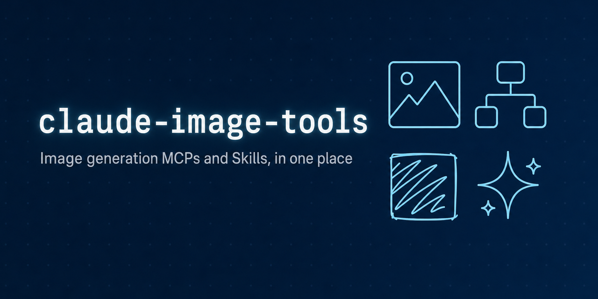
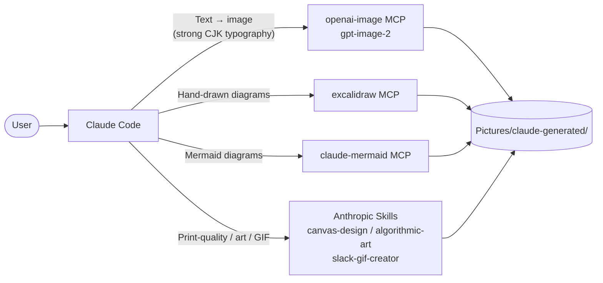

<p align="center">
  
</p>

# claude-image-tools

[](LICENSE)
[](#quick-start-windows)
[](https://claude.com/claude-code)

**English** · [日本語](README.ja.md)

> **Image generation in Claude Code, all in one place — just ask.**
> An operations hub that wires up image-generation MCPs and Skills for **Claude Code on Windows**, so OG banners, diagrams, posters, and GIFs become *"just ask Claude"* deliverables.

## What you get in 30 seconds

What you can ask Claude Code, and which tool runs underneath:

| Ask | Tool | Output |
|---|---|---|
| "Make an OG banner with a Japanese title 'Caveat' in the center" | `openai-image` (gpt-image-2) | 1024×1024 to 1536×1024 PNG (text rendering, especially CJK, holds up) |
| "Sketch a 3-node architecture diagram, hand-drawn style" | `excalidraw` MCP | Editable excalidraw scene + PNG export |
| "Flowchart: A → B → C" | `claude-mermaid` MCP | Live Mermaid preview + PNG/SVG |
| "Make a poster for Caveat with proper layout" | Anthropic Skill `canvas-design` | Print-quality PNG/PDF |
| "A 3-second celebration GIF for Slack" | Anthropic Skill `slack-gif-creator` | Optimized GIF under 100 KB |
| "Generative art in p5.js" | Anthropic Skill `algorithmic-art` | Parameter-tunable generative piece |

## Architecture



## How this differs from nearby choices

| Approach | Strengths | What this repo adds |
|---|---|---|
| Install a single MCP (e.g., only `openai-image`) | Simple | Bundles the right tool per use case so **Claude can pick** |
| ChatGPT / Midjourney web UI | Works out of the box | Stays in the editor: **generate → place → commit** in one flow |
| Hit `gpt-image` directly via API | Maximum flexibility | Routes diagrams / hand-drawn / GIFs / print-grade layout to **purpose-built tools** |

## Quick start (Windows)

> **Prerequisites**: Claude Code, Node.js, Python (uv), and `OPENAI_API_KEY` set as a Windows user environment variable.

```powershell
# 1. openai-image MCP (gpt-image-2)
uv tool install openai-gen-image-mcp
claude mcp add --scope user openai-image `
  -e OPENAI_API_KEY=$env:OPENAI_API_KEY `
  -- C:/Users/<your-username>/.local/bin/openai-gen-image-mcp.exe

# 2. claude-mermaid (Mermaid diagrams)
npm install -g claude-mermaid
claude mcp add --scope user mermaid -- claude-mermaid

# 3. excalidraw MCP (hand-drawn diagrams)
git clone https://github.com/yctimlin/mcp_excalidraw
cd mcp_excalidraw
npm install; npm run build
claude mcp add --scope user excalidraw -- node "$PWD/dist/index.js"
# When using it, run the canvas server in a separate process: npm run canvas (port 3000)

# 4. Bulk-install Anthropic Skills
claude plugin install example-skills@anthropic-agent-skills
```

> Replace `<your-username>` with your Windows account name (the value of `%USERNAME%`).

Verify connection:

```bash
claude mcp list
# Success when excalidraw / openai-image / mermaid all show ✓ Connected
```

## Smoke-test prompts

Try these in a fresh Claude Code session. Replace `<your-username>` with your
Windows account name, or point `output_path` at any folder you can write to
(e.g. `~/Pictures/claude-generated/`):

```
Use the openai-image MCP to generate a 1024x1024 image.
Prompt: "a small cute cat sitting on a wooden table, soft lighting".
output_path: C:/Users/<your-username>/Pictures/claude-generated/test-cat.png
```

```
Generate a 1200x630 image. Center a large "Caveat" title,
with a small Japanese subtitle "罠を記録する OSS" beneath it,
on a deep blue gradient background.
output_path: C:/Users/<your-username>/Pictures/claude-generated/test-og.png
```

If the text — Japanese in particular — renders cleanly, you're set.

## Windows-specific gotchas (you will hit these)

This stack hand-patches a few upstream packages so they run on Windows. See the checklist in [CLAUDE.md](CLAUDE.md) for exact patch points. Common symptoms:

- `mermaid_preview` errors with `spawn npx ENOENT` → `claude-mermaid`'s `spawn` calls are rewritten to go via `cmd.exe /c`
- `openai-image` dies right after launch → pass the API key through Claude Code config (Windows env-var propagation timing issue)
- `excalidraw`'s `export_to_image` rejects paths → it only writes under CWD; change the allowed base via `EXCALIDRAW_EXPORT_DIR`

<details>
<summary>Common OpenAI billing snags</summary>

- **ChatGPT Plus and pay-as-you-go are separate wallets**: a Plus subscription does *not* unlock the image API
- `gpt-image-2` requires **organization verification**: unverified orgs get a 403; verification takes up to 15 minutes
- Zero balance returns `billing_hard_limit_reached` (HTTP 400) — check the billing console first

</details>

<details>
<summary>Design choices for this repo</summary>

- **No application code lives here**: it's purely an operations hub for the MCP / Skill stack
- **Push fixes upstream**: root-cause fixes for the gotchas go to each upstream as PRs/Issues (notes accumulate via the `caveat` MCP)
- **Dogfooding**: the OG banner of this repo was generated by `openai-image` itself

</details>

## Output location

Default save path for generated images: `C:\Users\<your-username>\Pictures\claude-generated\`. New tools should follow the same convention.

## Contributing

Issues and PRs are welcome. Since the gotchas this hub documents are upstream
bugs, **upstream fixes are preferred** — open a PR/Issue against the affected
package (`claude-mermaid`, `mcp_excalidraw`, `openai-gen-image-mcp`) and link it
here so the workaround can be retired.

## License

[MIT](LICENSE)
